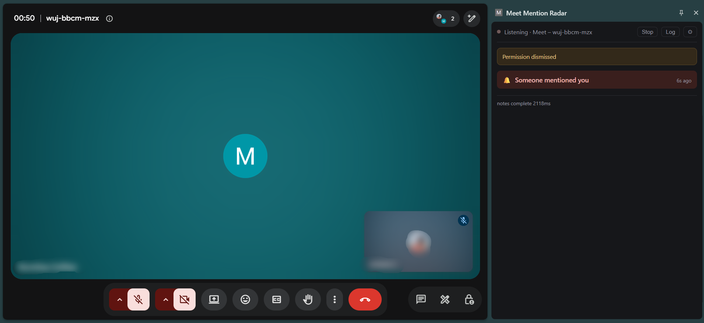
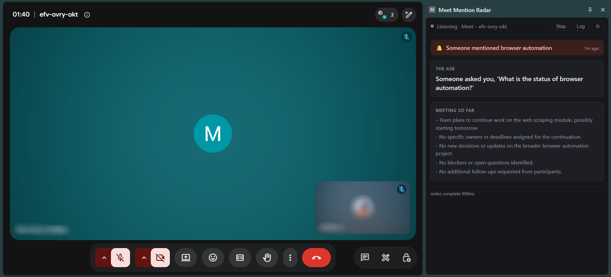
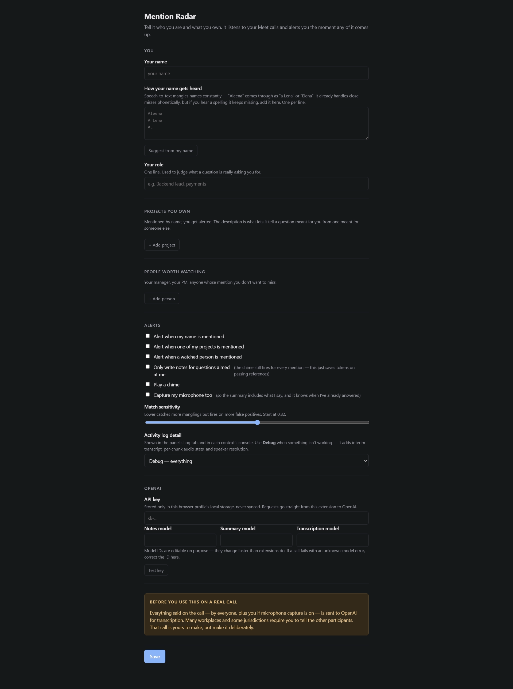

# Meet Mention Radar

A Chrome extension that listens to your Google Meet calls and alerts you the
moment you, a project you own, or someone on your watch list is mentioned —
then streams two notes into the side panel:

- **The ask** — what is being asked of you, in one line.
- **Context you need** — the earlier discussion that bears on your answer.

A rolling meeting summary sits below, refreshed in the background.

---

## Setup

1. `chrome://extensions` → enable **Developer mode** → **Load unpacked** → select this folder.
2. Click the extension icon → ⚙, or open the options page directly.
3. Fill in your name, projects, and people. Paste an OpenAI API key and hit **Test key**.
4. Join a Meet call and click the extension icon once. The side panel opens and capture starts.

Clicking the icon again stops the session.

---

## What it looks like

**Your name comes up.** The banner and the chime fire off the interim
transcript, before the sentence has finished. The footer prints how long the
notes took.



**A topic you own comes up.** Here it's a direct question, so the panel writes
*The ask* — the question in one line — and keeps the rolling *Meeting so far*
summary underneath it.



**What you can configure.** Your name and the manglings to watch for, projects
and people, which mentions alert, match sensitivity, log detail, and the OpenAI
key and model IDs.



---

## Latency design

Three tiers, because the alert has to beat the end of the sentence:

| Tier | When | What runs |
|---|---|---|
| ~0ms | on **interim** transcript tokens | local phonetic + fuzzy matcher → chime + banner |
| ~400ms | after the trigger | streaming LLM call → the two notes, `ask` first |
| background | every ~45s or ~1200 chars | rolling summary, aborted whenever a trigger needs the network |

The summary is what keeps the context note fast: at trigger time the model
composes from an already-digested summary instead of re-reading the meeting.

Names are the hard part. Speech-to-text mangles proper nouns constantly —
"Aleena" arrives as "a Lena". Two defences: proper nouns are sent to the
transcriber as `keywords` to bias it up front, and the matcher compares
Double Metaphone codes so close misses still land.

---

### Model IDs

The three model fields are editable on purpose — model IDs move faster than
extensions do. If a call fails with an unknown-model error, correct the ID in
options rather than editing code.

One constraint on the transcription model: proper-noun biasing needs a model
that supports the `keywords` parameter *and* server-side VAD. `gpt-transcribe`
(the default) does both. The `gpt-4o-transcribe` family has no `keywords`
support, and `gpt-live-transcribe` rejects `turn_detection` because it segments
turns itself. Point the field at a model without `keywords` and transcription
still runs — the client falls back to free-text `prompt` biasing and logs a
warning — but close-miss names land less often.

---

### Secrets

The logger masks anything under a credential-shaped key (`apiKey`, `token`,
`authorization`, …) and any bare `sk-…` string, wherever it appears — including
nested objects. Tests cover this, because the Copy button exists to paste
output elsewhere.

---

## Troubleshooting

### Panel says "Not listening yet" and nothing happens

Click the extension icon **in the toolbar** while the Meet tab is focused —
that's what starts capture. The panel's own Start button works too, but the
toolbar icon is the reliable path because `tabCapture` is gated on the
extension having been invoked for that tab.

If the icon opens the panel but never starts capture, check
`chrome://extensions` → *service worker* console for
`[MentionRadar] action clicked`. No log means `chrome.action.onClicked` isn't
firing — the cause is `sidePanel.setPanelBehavior({openPanelOnActionClick:
true})`, which makes Chrome consume the click itself. The extension sets this
to `false` on every start, and a test guards against it regressing.

### Nothing is transcribing

Open the Log view and read the `♪` heartbeat (see above). No chunks means the
audio graph; chunks without transcript means the socket or the key.

### Alerts never fire

Check the `watching N trigger phrase(s)` line at startup — it prints the actual
watch list. If it's empty or missing your name, the profile didn't save.

If the phrases are right, set log detail to **Debug** and watch the `⟨remote⟩`
interim lines: that shows you exactly what the transcriber heard, which is
usually the answer. Add whatever mangling you see to your alias list.

### Anything else

Failures surface as a banner in the panel *and* as an `error` row in the log.
Hit **Diagnose**, then **Copy** — that's the complete picture, with the API key
masked.

---

## Privacy and disclaimer

This is a personal project published for educational purposes. It is provided
as-is, with no warranty — you are responsible for how and where you use it,
and I accept no liability for any consequence of using it, including
recording, privacy, or compliance issues on your calls.

Everything said on the call — by everyone, plus you if microphone capture is
on — is streamed to OpenAI for transcription, and excerpts go to the chat
model for the notes.

**Many workplaces and some jurisdictions require you to tell the other
participants.** That's your call to make, but make it deliberately.

Your API key is stored in `chrome.storage.local` — this browser profile only,
never `chrome.storage.sync`. Requests go straight from the extension to
OpenAI with no intermediary. Anyone with access to this browser profile can
read the key. If you ever distribute this beyond yourself, replace the direct
key use with a token-minting proxy (see the auth comment in
`src/realtime-client.js`).

---

## Architecture

MV3 dictates the shape, for two hard reasons: `chrome.tabCapture.capture()`
cannot run in a service worker, and service workers are killed after ~30s idle
— which would take the transcription sockets with them. So audio and sockets
live in an offscreen document.

```
┌─ content.js ────────────┐   speaker activity   ┌─ service-worker.js ─────┐
│ meet.google.com         │ ───────────────────> │ profile + trigger match │
│ • call start/end        │                      │ LLM dispatch            │
│ • participant roster    │                      │ rolling summary worker  │
│ • active-speaker tiles  │                      └───────────┬─────────────┘
└─────────────────────────┘                                  │ port
                                                             ▼
┌─ offscreen.js ──────────────────────────┐        ┌─ sidepanel.js ─────────┐
│ tabCapture ──┐                          │        │ 🔔 alert banner        │
│              ├─ AudioWorklet → PCM16    │ ─────> │ Note 1 · the ask       │
│ getUserMedia ┘   ├─ WS #1 (tab audio)   │ trans- │ Note 2 · context       │
│                  └─ WS #2 (mic, gated)  │ cript  │ rolling summary        │
│ loopback → speakers · alert chime       │        └────────────────────────┘
└─────────────────────────────────────────┘
```

**Two sockets, not one mixed stream.** OpenAI Realtime transcription returns
no speaker diarization, so the audio *channel* is the only reliable way to
tell you apart from everyone else. Mixing would throw that away permanently.
The mic socket is VAD-gated in the worklet, so it only bills while you're
actually talking.

**Speaker names** come from Meet's own active-speaker indicator, correlated
against transcript timestamps. This is best-effort: if Meet's markup has
moved, segments read as "Someone" and the panel says so, rather than
confidently mislabelling everyone.

### Files

| Path | Role |
|---|---|
| `src/realtime-client.js` | **the only file that knows the Realtime wire format** |
| `src/detect/matcher.js` | trigger matching — the 0ms tier |
| `src/detect/metaphone.js` | Double Metaphone |
| `src/audio/pcm-worklet.js` | downmix → anti-alias → resample → PCM16 → VAD |
| `src/offscreen/offscreen.js` | capture, both sockets, alert chime |
| `src/service-worker.js` | orchestration, attribution, LLM dispatch |
| `src/content.js` | Meet DOM (the fragile surface) |
| `src/llm/notes.js` | the two notes |
| `src/llm/summary.js` | rolling summary |

---

## Contributing

Open to contributions — issues and pull requests are welcome.

Expanding to other platforms — Zoom, Teams — is the most wanted addition. Only
`src/content.js`, the matches in `manifest.json`, and two `meet.google.com`
URL checks in `src/service-worker.js` are Meet-specific; the rest already
knows nothing about Meet.

If you found this helpful, a ⭐ is appreciated.
